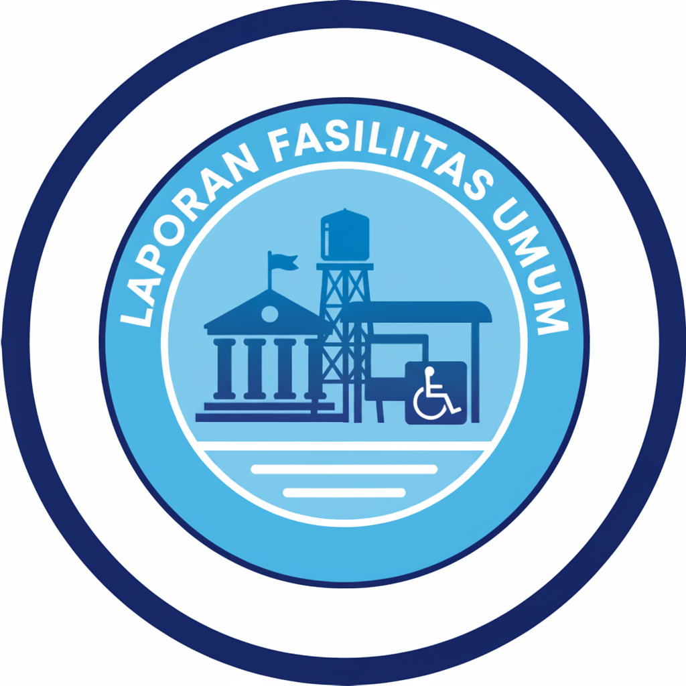

# 🏛️ LAPORAN FASUM (Layanan Aspirasi Fasilitas Umum)

  

## Tentang Proyek

**LAPORAN FASUM** adalah platform digital berbasis web yang dikembangkan dengan **Laravel 12** untuk memudahkan masyarakat dalam melaporkan kerusakan fasilitas publik. Sistem ini bertujuan untuk menciptakan transparansi dan mempercepat proses perbaikan fasilitas umum oleh pihak terkait.

## Fitur Utama

-   **Pelaporan Online**: Kirim laporan kerusakan lengkap dengan foto bukti.
-   **Tracking Status**: Pantau proses perbaikan secara real-time (Lapor -> Proses -> Selesai).
-   **Admin Panel**: Kelola semua laporan masuk secara efisien.
-   **Dashboard User**: Riwayat laporan yang pernah dikirimkan.

## Teknologi yang Digunakan

-   **Framework**: [Laravel 12](https://laravel.com)
-   **Frontend**: Tailwind CSS & Blade Templating
-   **Database**: MySQL / MariaDB
-   **Tooling**: Vite, Composer, & NPM

## ⚙️ Cara Instalasi

1. Clone repositori: `git clone https://github.com/MarwahIsrakPadang/Project-Laporan-Fasum.git`
2. Install dependencies: `composer install` & `npm install`
3. Salin `.env.example` ke `.env` dan atur database.
4. Generate key: `php artisan key:generate`
5. Jalankan migrasi: `php artisan migrate`
6. Jalankan server: `php artisan serve`
